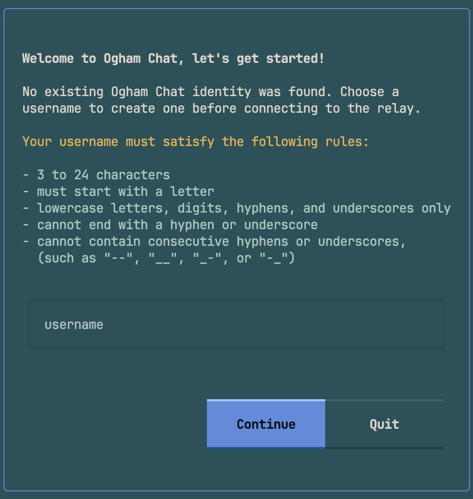

# Ogham Chat ᚛ᚑᚌᚆᚐᚋ᚜

Relay-first in-terminal chat app built with Textual.

### Version: 0.1.0-beta.3

**Ogham Chat** is a terminal UI client for person-to-person messaging over an online relay.

## Screenshots


## Release Scope

- Beta release: not all planned core features are complete.


## Beta Status

Known gaps before stable release:

- Redis-backed features are incomplete or not fully integrated.
- End-to-end crypto flows are incomplete/missing.

## Install

Coming soon!

<!-- ## Install (Homebrew Tap)

```bash
brew tap jriggles/ogham-chat
brew install ogham-chat
```

If your tap name differs, use the tap path from your Homebrew tap repository. -->

## Quickstart (Relay)

Run `ogham`. The TUI will open, look for an existing local identity in your
system keychain, and prompt you to create one if none is found.

Run two terminals and connect both users to the same relay endpoint.

Terminal 1:

```bash
ogham
```

Terminal 2:

```bash
ogham
```

Both terminals can send messages by typing and pressing Enter once their local
identity has been resolved.

Usernames currently follow a strict canonical policy:

- 3 to 24 characters
- lowercase ASCII letters, digits, hyphen, and underscore only
- must start with a letter
- cannot end with a hyphen or underscore
- cannot use consecutive separators such as `--`, `__`, `-_`, or `_-`

The short version is:

> Username may contain only lowercase letters, digits, hyphens, and underscores, and must start with a letter.

## Local Test Modes

`host` and `join` are developer-only local testing paths. They are not the
intended public product interface and may be hidden or removed later.



## Hosted Relay

The current relay endpoint is:

`wss://ogham-chat.fastapicloud.dev/api/v1/ws`

## Contact Tree and Groups

The contacts sidebar now uses a tree with two root sections:

- Online
- Offline

Uncategorized contacts appear directly under Online or Offline.

You can manage one-level groups with slash commands:

```text
/group add <username> <group>
/group remove <username> <group>
/group delete <group>
/group list [username]
```

Groups are mirrored under both Online and Offline branches, so the same group name can show online and offline members separately.

Local app preferences persist in a single config file at:

```text
~/.ogham-chat/.oghamrc
```

This includes:

- Contact groups (`groups_by_user`)
- Last selected UI theme (`theme`)

Local identity records are stored separately in the system keychain so they can
later expand to hold sensitive key material without writing that identity data
into `.oghamrc`.

## Core Commands

- `/account list`
- `/account add <username>`
- `/account switch <username>`
- `/account delete <username>`
- `/contact add <username>`
- `/contact remove <username>`
- `/group add <username> <group>`
- `/group remove <username> <group>`
- `/group delete <group>`
- `/group list [username]`
- `/theme list`
- `/theme set <theme_name>`

## Contributing

Developer setup, source workflows, linting, backend operations, and release
details are documented in [CONTRIBUTING.md](CONTRIBUTING.md).
